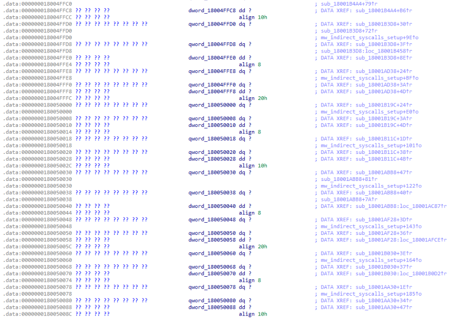

# An analysis of syscall usage in Cobalt Strike Beacons

Thanks to the suggestion of my good friend [Nat (0xDISREL)](https://twitter.com/0xDISREL), I spent the last week digging into a Cobalt Strike beacon made with the latest leaked builder. His idea was to analyze and understand how CS approached syscalls.

## Sample

This analysis was conducted in an x64 bit payload with the hash `020b20098f808301cad6025fe7e2f93fa9f3d0cc5d3d0190f27cf0cd374bcf04`, generated by the recently leaked 4.8 version of Cobalt Strike. It's publicly available for download in [unpacme](https://unpac.me).I will not go over unpacking the sample for the sake of brevity, but doing so is pretty straightforward and shouldn't present any problems.

## A quick refresher

Before we get to the actual reversing, let's get a quick refresher on what system calls look like under Windows.

According to calling convention, arguments are setup in the appropriate registers before the instruction `SYSCALL` is executed, handling execution to the Kernel. One of such arguments is the code for the system call (in the picture above, it's passed via the `eax` register). These system calls reside in ntdll and provide evasion benefits by allowing you to avoid calling APIs that are likely hooked by AV/EDR.

## How Cobalt Strike does it

During the first steps of analysis of the unpacked payload we'll come across references to qwords and calls to registers.

Inspecting said qwords will lead us to the `.data` section, where they don't hold any values (yet).

Inspecting other references to these addresses will land us in a function that looks a lot like an import by hash routine - there are repeated calls to the same function, each time passing a different hexadecimal value and memory address among its arguments.

Case closed then, the empty qwords would receive pointers to the resolved API functions, right? All that's left is to identify the hashing algorithm and start renaming things? Well, not quite. This write-up is not called "analyzing import by hash", after all.

Let's take a look at the function that's called before all the hashes start showing up. I've named it `mw_prepare_indirect_syscalls`. 

The first part of it is run of the mill PEB walking and PE parsing to get names of exported functions. Note also that there is a check of `IMAGE_EXPORT_DIRECTORY.Name` against `ntdll.dll` very slightly obfuscated (it's just written backwards and split over three `cmp` instructions). This tells us the author is only interested in ntdll. That makes sense, considering they're after syscalls. There is a `memset` , to which we'll come back later.

The next block of code will check the start of the API name for the prefixes Ki and Zw. 

