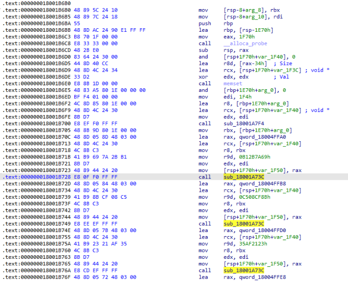
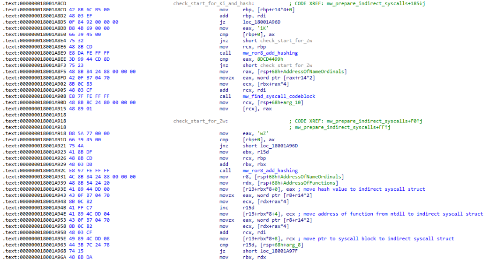
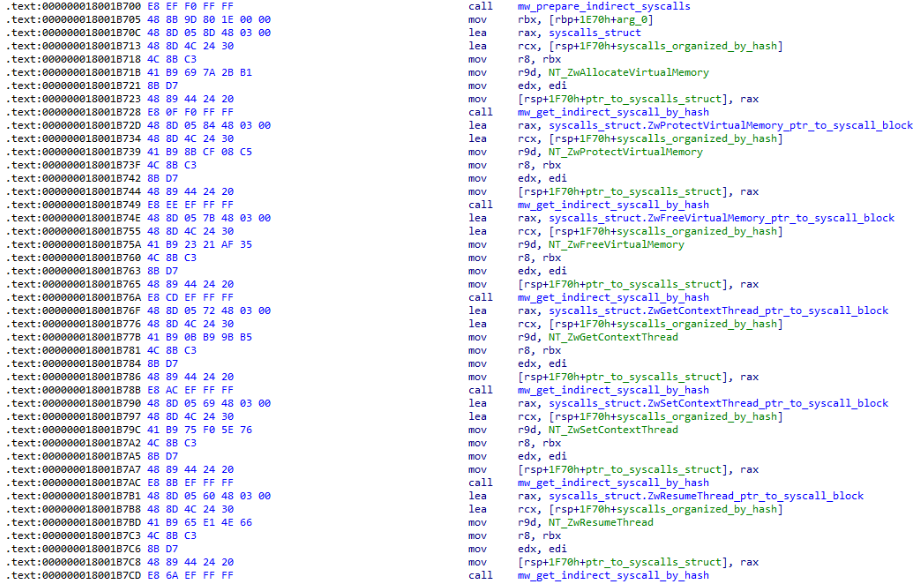
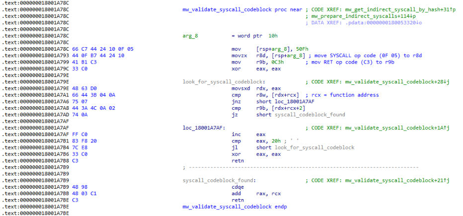

# An analysis of syscall usage in Cobalt Strike Beacons

Thanks to the suggestion of my good friend [Nat (0xDISREL)](https://twitter.com/0xDISREL), I spent the last week digging into a Cobalt Strike beacon made with the latest leaked builder. His idea was to analyze and understand how CS approached syscalls.

## Sample

This analysis was conducted in an x64 bit payload with the hash `020b20098f808301cad6025fe7e2f93fa9f3d0cc5d3d0190f27cf0cd374bcf04`, generated by the recently leaked 4.8 version of Cobalt Strike. It's publicly available for download in [unpacme](https://unpac.me). I will not go over unpacking the sample for the sake of brevity, but doing so is pretty straightforward and shouldn't present any problems.

## A quick refresher

Before we get to the actual reversing, let's get a quick refresher on what system calls look like under Windows.


According to calling convention, arguments are setup in the appropriate registers before the instruction `SYSCALL` is executed, handling execution to the Kernel. One of such arguments is the code for the system call (in the picture above, it's passed via the `eax` register). These system calls reside in ntdll and provide evasion benefits by allowing you to avoid calling APIs that are likely hooked by AV/EDR.

## How Cobalt Strike does it

During the first steps of analysis of the unpacked payload we'll come across references to qwords and calls to registers.


Inspecting said qwords will lead us to the `.data` section, where they don't hold any values (yet).


Inspecting other references to these addresses will land us in a function that looks a lot like an import by hash routine - there are repeated calls to the same function, each time passing a different hexadecimal value and a `.data` section address among its arguments.



Case closed then, the empty qwords would receive pointers to the resolved API functions, right? All that's left is to identify the hashing algorithm and start renaming things? Well, not quite. This write-up is not called "analyzing import by hash", after all.

Let's take a look at the function that's called before all the hashes start showing up. I've named it `mw_prepare_indirect_syscalls`. 


### Preparing system calls

The first part of it is run of the mill PEB walking and PE parsing to get names of exported functions. Note also that there is a check of `IMAGE_EXPORT_DIRECTORY.Name` against `ntdll.dll` very slightly obfuscated (it's just written backwards and split over three `cmp` instructions). This tells us the author is only interested in ntdll. That makes sense, considering they're after syscalls. There is a `memset` , to which we'll come back later.

The next block of code will check the function name for the prefixes Ki and Zw.If either prefix matches there is a call to the hashing function, which is a `ROR 8 ADD` algorithm that iterates over each `word` and uses `0x52964EE9` as a hardcoded XOR key.




A function starting with Ki will only be used if its hash matches `0x8DCD4499`; on a 22H2 version of Windows 10 I couldn't find an export from ntdll that matched such value. This routine then will act on at most one function starting with Ki and all starting with Zw. Appropriate values will populate a structure whose address was supplied to `mw_prepare_indirect_syscalls` - I've decided to call it `syscalls_organized_by_hash`. It is described below.

```
struct syscalls_organized_by_hash {
DWORD function_hash;
DWORD ntdll_address_of_function;
QWORD ptr_to_function_syscall_block;
};
```

`function_hash` is the calculated hash for the exported function; `ntdll address of function` is an address to the function's code as pointed to by `IMAGE_EXPORT_DIRECTORY.AddressOfFunctions`; `ptr_to_function_syscall_block` is a pointer to the system call gadget related to said function, which resides in ntdll.dll memory. Remember the `memset` call earlier? It's used to zero that structure out. The `r13` register points to it, and the additions at each address confirm the size of each struct member. After all the Zw prefixed functions are placed in the structure, an algorithm will sort their positions according to the `ntdll_address_of_function`, from lowest to highest. After this is done, the struct will contain the hashes, addresses of functions in the ntdll executable and pointers to the syscall gadgets for all functions with a Zw prefix, sorted in ascending order according to the `ntdll_address_of_function` values.

### Setting up the syscalls structure

Going back to the function that resembled import by hash with what we've learned, we can see the that `mw_get_indirect_syscalls_by_hash` is supplied the `syscalls_organized_by_hash`, alongside the hash and a pointer to those empty qwords. After using the hashing algorithm to generate enums from ntdll exports, we can solve the hashes to see which APIs they intended to get the syscall code blocks to.



`mw_get_indirect_syscalls_by_hash` works by looking for the supplied hash in the `syscalls_organized_by_hash` structure. Once that is found, it will retrieve the pointer to the syscall code block and call a function that validates said block - `mw_validate_syscall_codeblock`.

The way the verification works is simple. It will loop through the `syscalls_organized_by_hash` struct (they are actually organized by ascending order of `ntdll_address_of_function`, but I didn't know that back when I created the structure) until it finds the supplied hash. The functions are organized inside ntdll by ascending order of syscall codes - a function that uses code `0x1` is succeeded by one that uses code `0x2` and so forth. Because of this, once a hash is found the counter in `edi` will be equal to the syscall code. The validation function checks for the op codes of the `SYSCALL` and `RET` instructions.




Once the desired entry is found, a new structure (which I've named `syscalls`) will receive a pointer to the syscall code block, a pointer to the `SYSCALL` instruction and the value of the syscall code. Although the code is a `dword`, I've made all members of struct qwords for convenience (that way I don't need to create a member for padding between different syscalls entries). The struct is as follows:

```
struct syscalls {
QWORD ptr_to_syscall_block;
QWORD ptr_to_syscall_instruction;
QWORD syscall_code;
};
```

Now all that's left is use that model to generate the structure that will result from setting up the syscalls and apply it to the range of qwords that are passed to the `mw_get_indirect_syscalls_by_hash` function. Following cross-references to each member will lead us to places where the structure is used in the beacon code.


### Syscall usage

