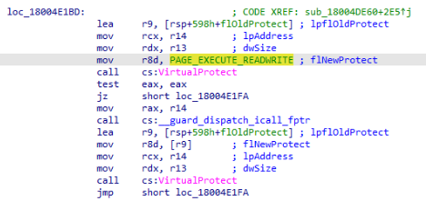

# SmoothOperator

This analysis is focused on the SmoothOperator payloads from Sentinel One. They were obtained via [vx-underground](share.vx-underground.org) and comprise two DLLs. The first stage has the hash **bf939c9c261d27ee7bb92325cc588624fca75429**.

## First stage

This DLL is a straightforward PE loader, with no obfuscation or encryption present. A good first step is looking for references to `VirtualProtect` - there are two.



First one looks promising, given the ERW flag being passed to it. Checking the function called afterwards (`__guard_dispatch_icall_fptr`) leads us to an offset, which in turn leads to `jmp rax`. This is probably a jump to unpacked code or the next stage. Let's circle back to the start of the function where those calls to `VirtualProtect` are and see what exactly we're marking as executable and then jumping to.


This looks promising. A DLL named `d3dcompiler_47.dll` and a call to `CreateFileW`, followed by memory allocation of the same size as that file. Moving on, we'll see some obvious parsing of a PE file.


Finally, we see a loop that starts looking for the sequence `0xFE 0xED 0xFA 0xCE` at the Security directory of `d3dcompiler_47.dll` and moves forward. If we can find that sequence of bytes in a DLL file, we probably have `d3dcompiler_47.dll` - it just so happens that sequence in present in the second DLL from Sentinel One, **20d554a80d759c50d6537dd7097fed84dd258b3e**. Going forward there are several arithmetic operations followed by the aforementioned `VirtualProtect` and `jmp rax`. Instead of worrying about those, just pop the DLL into a debugger, rename `20d554a80d759c50d6537dd7097fed84dd258b3e` to `d3dcompiler_47.dll` and run until the `jmp rax`. First stage is done.

## Second stage

A quick glance at the debugger following the jmp to rax shows we land at some shellcode at allocated memory.


The dump window also shows the same memory region. One should be careful when dumping it though, since there's plenty of random data preceding the shellcode and `d3dcompiler_47.dll`; throwing it in Ida before getting rid of that data will make for an annoying time.

On that note, even though Ida Home supports shellcode analysis, I decided to convert this stage to a PE file. The reason is twofold: first, it means I won't have to import local types manually; second, it means I can keep the dump as is, which is advantageous because we'll be able to follow direct references to the DLL that follows the shellcode. For that end, I do a simple hack with [FASM](https://flatassembler.net/):

```
include '..\..\fasmw17330\include\win64ax.inc'

.code

start:

  file 'stage2.bin'
  
  invoke ExitProcess, 0
  
.end start
```

The start of the shellcode features basic position independent code (`call $+5` followed by `pop rcx`), which is used to get the address of the start of the DLL read into memory by the first stage into `rcx`. Another displacement is applied to get a pointer to what appears to be an User-Agent string into `r8`:

```
1200 2400 "Mozilla/5.0 (Windows NT 10.0; Win64; x64) 
AppleWebKit/537.36 (KHTML, like Gecko) 3CXDesktopApp/18.11.1197 
Chrome/102.0.5005.167 Electron/19.1.9 Safari/537.36”
```


The next call is to a function that will be tasked with mapping `d3dcompiler_47.dll`. Although it's already in memory, it has not been mapped as an executable needs to be before it's able to run. Here's the start of it, after renaming and adjusting types for the arguments to match what was placed in the registers preceding the call.


In another common practice with shellcode, API hashes are present. [HashDB](https://hashdb.openanalysis.net/) identifies the algorithm employed here as one used by Metasploit. If one decides to look into the `mw_import_by_hash` function, it's important to remember that this code deals with `PEB64` and `TEB64`, structs that I couldn't find in Ida. I recommend [this resource from BITE*](http://bytepointer.com/resources/tebpeb64.htm) to create your own struct for both. Doing this will solve you a couple hours of confused cursing at the 32 bit structures.
